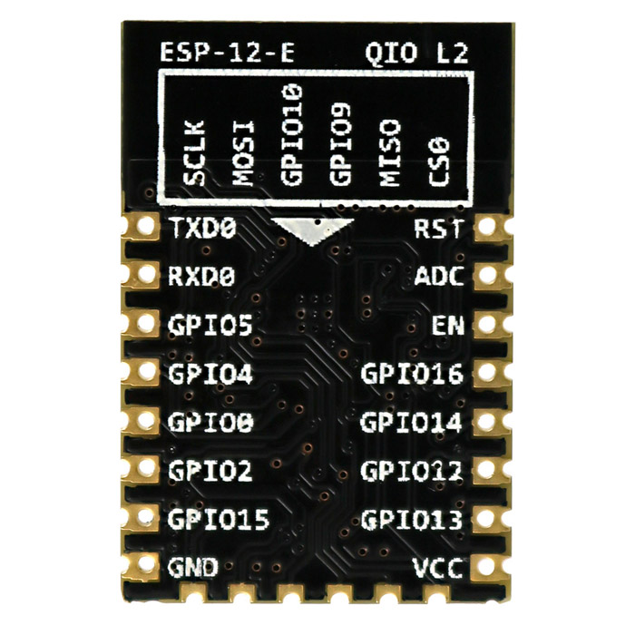
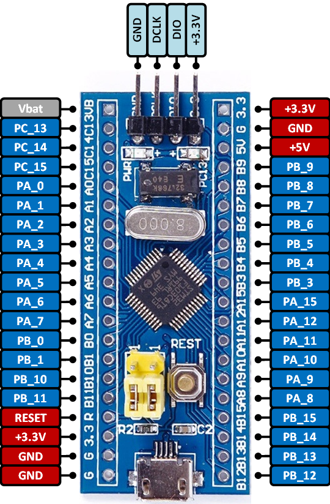
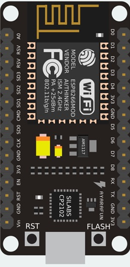
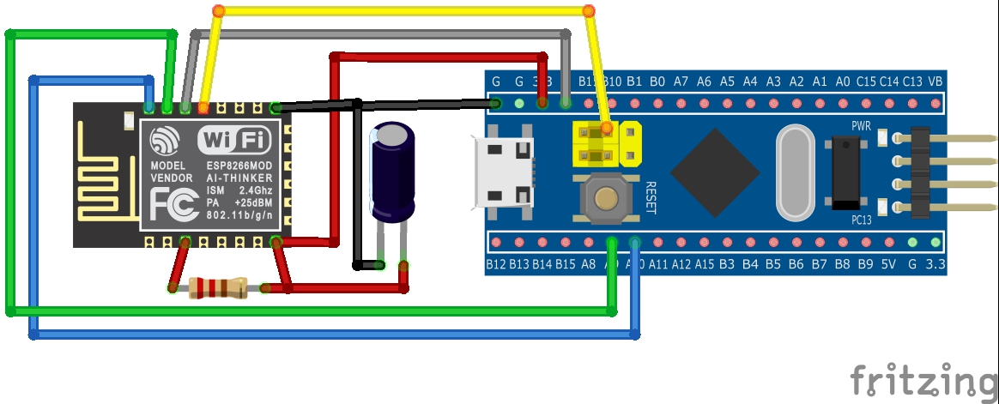
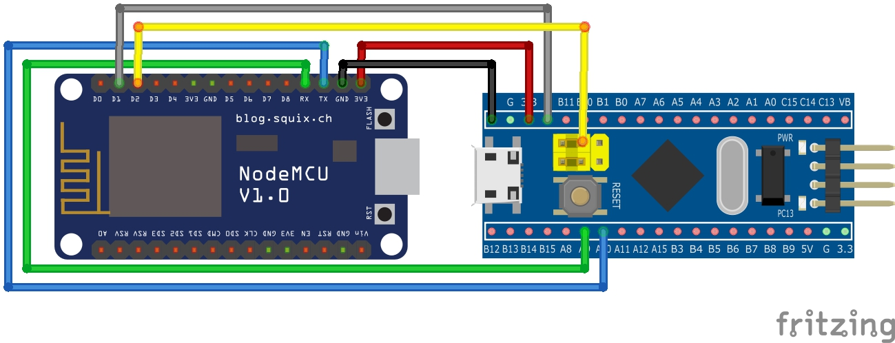
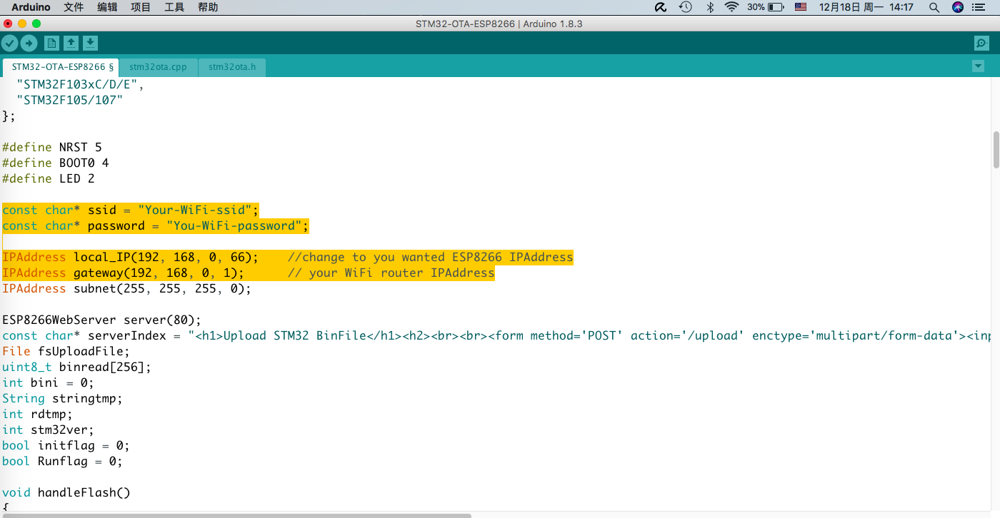
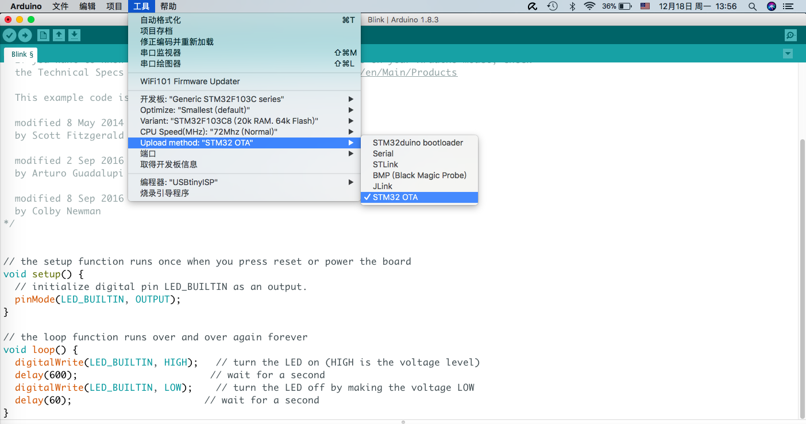

# STM32-OTA on Arduino IDE (version for Windows)

-----
### With a ESP8266, It can upload sketch to STM32 series MCU on Arduino IDE without any wires.

### [Veiw on YOUTUBE](https://youtu.be/3Bh6Y-V-LYg)

#### TESTED: STM32F03xF/K/C/,F103C8/B, (Blue Pill and Black Pill), F103VCT, F107RCT.

|If use ESP8266 Pin |STM32 MCU  |if use NodeMCU Pin |
| :-----: |:-----:| :-----:|
|RXD|PA9|RXD|
|TXD|PA10|TXD|
|Pin4|BOOT0|D2|
|Pin5|RST|D1|
|Vcc|3.3|3.3V|
|GND|GND|GND|
| En -> 3.3V |

-----
## Boards
  ---   ---   

-----
## Schematic

#### 1. Use ESP-12E 
     

#### 2. Use NODEMCU 
 

-----
## SETUP

### 1st step -> Flash ESP8266 

1. Download source-codes from [HERE](https://github.com/levkovigor/STM32-OTA-ESP8266-for-windows/STM32-OTA-ESP8266)
2. Setup your WiFi and ESP8266 IPAddress to yours
 
3. upload to ESP8266.   Don't know how to Flash ESP8266?  [HELP](https://github.com/esp8266/Arduino) version 2.4.2  

### 2nd step -> Arduino IDE setup

#### -> For Arduino_STM32  [Repo link](https://github.com/stm32duino/Arduino_Core_STM32)
1. Copy "stm32-ota.sh" to "C:\Users\{USERNAME}\AppData\Local\Arduino15\packages\STMicroelectronics\tools\STM32Tools\{VERSION}\"
 
2. Find the file 'C:\Users\{USERNAME}\AppData\Local\Arduino15\packages\STMicroelectronics\hardware\stm32\{VERSION}\platform.txt'. and add below lines to the end of 'platform.txt'    
	> \# Upload using STM32 OTA over HTTPServer added by CSNOL        
>tools.stm32_ota.path={runtime.tools.STM32Tools.path}    
>tools.stm32_ota.busybox=  
>tools.stm32_ota.busybox.windows={path}/win/busybox.exe
>tools.stm32_ota.cmd=stm32_ota.sh
>tools.stm32_ota.upload.params.verbose=-d
>tools.stm32_ota.upload.params.quiet=
>tools.stm32_ota.upload.pattern="{busybox}" sh "{path}/{cmd}" {upload.IPAddress}  "{build.path}/{build.project_name}.bin"

3. Please add below lines to the end of your Arduino_STM32 C:\Users\{USERNAME}\AppData\Local\Arduino15\packages\STMicroelectronics\hardware\stm32\{VERSION}\boards.txt       
	>\# STM32 OTA uploader ---- added by CSNOL    
>GenF1.menu.upload_method.httpMethod=STM32 OTA  
>GenF1.menu.upload_method.httpMethod.upload.protocol=stm32_ota  
>GenF1.menu.upload_method.httpMethod.upload.tool=stm32_ota 
>GenF1.menu.upload_method.httpMethod.upload.IPAddress=http://192.168.0.66    \# Change to your ESP8266 board's IPAddress

4. Restart Arduino IDE, you will find STM OTA upload method has been added.

 

### -> Now, you can OTA upload to STM32 MCU without any wires!

-----
### BTW
* If you just wanna OTA upload a bin file to STM32, please see [HERE](https://github.com/csnol/1CHIP-Programmers)
* If you want to keep STM32-bootloader, please change the STM32STADDR in "stm32ota.h"    
 
>\#define STM32STADDR  	0x8000000     // STM32 codes start address, you can change to other address if use custom bootloader: like 0x8002000

-----
## TODO: 
> 1. OTA upload all STM32 series MCU in Arduino IDE.
> 2. Make a video upload to Youtube.

## LICENSE

Copyright (C) 2017 by  [CS.NOL](https://github.com/csnol/STM32-OTA) . This program is free software: you can redistribute it and/or modify it under the terms of the GNU General Public License as published by the Free Software Foundation, either version 3 of the License, but you have to keep below webserver code in your sketch for sharing.
>  Version 1.0 by <a style="color:white" href="https://github.com/csnol/STM32-OTA">CSNOL 

